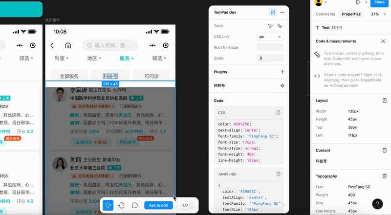

# WZ Style Plugin

一个用于将 CSS 样式转换为 WZ 类名的 [TemPad Dev](https://github.com/ecomfe/tempad-dev) 插件。

该插件可以智能识别 CSS 样式并转换为对应的 WZ 类名，支持 padding、margin、font-size 等属性的组合匹配和转换。

> 详细的样式规范和类名说明请参考 [WZ Taro Tools 文档](https://wz-taro-tools.now.baidu-int.com/components/style/)

## 安装

1. 从 Chrome Web Store 安装 [TemPad Dev](https://chromewebstore.google.com/detail/tempad-dev/lgoeakbaikpkihoiphamaeopmliaimpc)

2. 在 TemPad Dev 的插件区域安装 `@baidu/wz` 插件

## 使用

